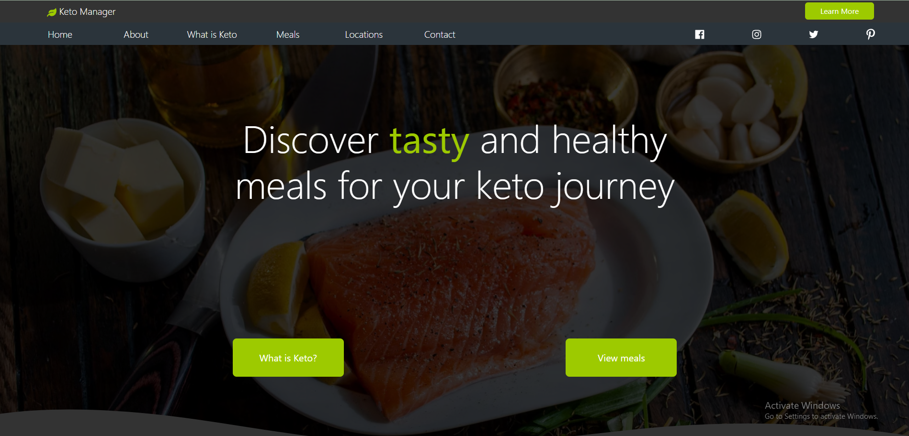

# Keto Manager: Discover popular keto meals

## A one page React application where you learn and explore the wonders of the keto diet

Many people, including myself in the past, struggle with obesity and want to find a resonable diet that can help them shred weight. This projects seeks help people with this very issue by exploring the science, guidelines, and meals within the keto diet. This project uses data from the Spoonacular API to assist users in finding keto friendly meals that work for them. The prominant features in this app include: 

* Search bar for find a variety of keto meals matching the query
* A featured meals tab that randomly generates a variery of popular keto meals
* Weekly meal planner (coming soon)
* Locations section showing keto managers locations

Keto Managers is not a real business with locations.

## This projects serves as an example of my skills in various frontend development including: 

* HTML, CSS, SASS, Javascript, React
* REST API's
* state management
* naming conventions
* file management
* One page applications
* advanced styling
* UI/UX
* SOlID principles

## Packages used
* axios
* react-bootstrap
* framer-motion
* leaflet
* react-pro-sidebar
* react-scroll
* react-responsive

## How to view this project

This project can be viewed on its own domain at ketomanager.com

To view this project on your own local host
1. clone the project (prefferably on a text editor)
2. install node js
3. navigate to its main directory via terminal 'cd keto-managers'
4. run project with 'npm start'

## Known issues

issues within this project range from minor styling errors to missing features that will be implemented soon

components within the project that are not currently in use are marked with commenets explaning their future implementation

* Flickering of the images on About section at a certain viewport (framer-motion related bug)
* Poor image resolution on generated images from Spoonacular
* Lack of responsiveness for tablet and phone breakpoints (work in progress)
* Application crashes if daily requests limit is reached on Spoonacular
* Buttons lacking any function (work in progess)
    * Learn More navigation buttons
    * two hero home buttons
    * find locations button
    * Learn more button on meal cards
    * view on map location button

